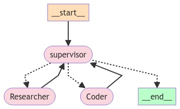

# Lab 2: Building multi-agent app with Langgraph.
In this lab you will learn how to build a multi-agent app using Langgraph framework. We will build a two agents chat (Researcher and Coder) with common State. There will also be a supervisor which will decide who will talk next:


## Prerequisutes:
- OpenAI API key with a few Euros credits
- Google account

## Task 1: Set-up
1. Open Google Colab: https://colab.research.google.com/
2. Create new notebook, name it eg. **Workshop4 - la2**
3. First, we need to install dependencies. In the first cell type and run:

```python
!pip install --quiet langchain langchain_openai langchain_experimental langsmith langgraph langchainhub==0.1.15
```

4. Create a configuration for GPT-4o LLM:

```python
from google.colab import userdata
from langchain_openai import ChatOpenAI

os.environ["OPENAI_API_KEY"] = userdata.get('openai_key')
gpt4 = ChatOpenAI(model = "gpt-4o", temperature = 0)
```

5. And LangSmith configuration:

```python
import os
os.environ["LANGCHAIN_TRACING_V2"] = "true"
os.environ["LANGCHAIN_PROJECT"] = "ai-workshops-day4"
os.environ["LANGCHAIN_ENDPOINT"] = "https://api.smith.langchain.com"
os.environ["LANGCHAIN_API_KEY"] = "<YOUR_KEY>"
```

## Task 2: Create two agents chat.

1. First, let's create a researcher agent. He will use Tavily for researching. Here we use **create_react_agent** from Langgraph. That simplifies creating the agents for Langgraph. This method will replace legacy **AgentExecutor** class.

```python
from langchain_community.tools.tavily_search import TavilySearchResults
from langchain import hub
from langgraph.prebuilt import create_react_agent

os.environ["TAVILY_API_KEY"] = userdata.get('tavily_key')

tavily_tool = TavilySearchResults(max_results=3)

system_message = "You are a helpful assistant. Your role is to research the web for data and information"

agent_researcher = create_react_agent(gpt4, [tavily_tool], messages_modifier=system_message)
```

2. We can test the agent:

```python
inputs = {"messages": [("user", "who is the winnner of the man's us open?")]}
for s in agent_researcher.stream(inputs, stream_mode="values"):
    message = s["messages"][-1]
    if isinstance(message, tuple):
        print(message)
    else:
        message.pretty_print()
```

3. Now, let's create a coder agent:

```python
from langchain_experimental.utilities import PythonREPL
from langchain_core.tools import Tool

python_repl = PythonREPL()

repl_tool = Tool(
    name="python_repl",
    description="A Python shell. Use this to execute python commands. Input should be a valid python command. If you want to see the output of a value, you should print it out with `print(...)`.",
    func=python_repl.run,
)

system_message = "You are a helpful assistant. Your role is to write and execute Python code only."

agent_coder = create_react_agent(gpt4, [repl_tool], messages_modifier=system_message, debug=True)
```

4. And test it:

```python
inputs = {"messages": [("user", "Write a code that count fibonacci and execute it for n=12")]}
for s in agent_coder.stream(inputs, stream_mode="values"):
    message = s["messages"][-1]
    if isinstance(message, tuple):
        print(message)
    else:
        message.pretty_print()
```

5. Now we need supervisor. So a node, that will decide which agent should talk. We will use GPT Tool Calling for this:

```python
from langchain_core.prompts import ChatPromptTemplate, MessagesPlaceholder
from langchain_core.output_parsers.openai_functions import JsonOutputFunctionsParser

system_prompt = (
    """You are a supervisor tasked with managing a conversation between the
    following workers: Researcher, Coder. 
    Researcher is responsible for gathering data and information from web. 
    Coder is responsible for code writing and executing.
    Given the following user request, respond with the worker to act next. Each worker will perform a
    task and respond with their results and status. When a task is done, respond with FINISH."""
)
options = ["Researcher", "Coder", "FINISH"]
function_def = {
    "name": "route",
    "description": "Select the next role.",
    "parameters": {
        "title": "routeSchema",
        "type": "object",
        "properties": {
            "next": {
                "title": "Next",
                "anyOf": [
                    {"enum": options},
                ],
            }
        },
        "required": ["next"],
    },
}
prompt = ChatPromptTemplate.from_messages(
    [
        ("system", system_prompt),
        MessagesPlaceholder(variable_name="messages"),
        (
            "system",
            "Given the conversation above, who should act next?"
            " Or should we FINISH? Select one of: [Researcher, Coder, FINISH]",
        ),
    ]
)

supervisor_chain = (
    prompt
    | gpt4.bind_functions(functions=[function_def], function_call="route")
    | JsonOutputFunctionsParser()
)
```

6. Then, we need a graph state. For now it will contains two variables: messages list and an indicator where to route next:

```python
import operator
from typing import Annotated, Any, Dict, List, Optional, Sequence, TypedDict
import functools
from langchain_core.messages import BaseMessage, HumanMessage
from langchain_core.prompts import ChatPromptTemplate, MessagesPlaceholder


class AgentState(TypedDict):
    messages: Annotated[Sequence[BaseMessage], operator.add]
    # The 'next' field indicates where to route to next
    next: str
```

7. Now we need to create graph nodes. They will execute the agent and update the state. Node for the researcher:

```python
def research_node(state: AgentState):
    result = agent_researcher.invoke({"messages": state["messages"]})
    return {"messages": [HumanMessage(content=result["messages"][-1].content, name="Researcher")]}
```

8. Node for coder:

```python
def code_node(state: AgentState):
    result = agent_coder.invoke({"messages": state["messages"]})
    return {"messages": [HumanMessage(content=result["messages"][-1].content, name="Coder")], }
```

9. And node for Supervisor:

```python
def supervisor_node(state: AgentState):
    result = supervisor_chain.invoke({"messages": state["messages"]})
    return {"next": result["next"]}
```

9. Finally, we can build our graph. Nodes first:

```python
from langgraph.graph import StateGraph, END

workflow = StateGraph(AgentState)
workflow.add_node("Researcher", research_node)
workflow.add_node("Coder", code_node)
workflow.add_node("supervisor", supervisor_node)
```

10. We need to define the logic about how to conversation will be routed between agents. Here the logic is simple because the **supervisor** indicated who should speak next:

```python
def should_continue(state):
    if (state["next"] == "FINISH"):
        return END
    return state["next"]
```

11. Now, let's add edges. The **add_conditional_edges** should return the name of the next node.

```python
workflow.add_edge("Researcher", "supervisor")
workflow.add_edge("Coder", "supervisor")

workflow.add_conditional_edges("supervisor", should_continue)
```

12. And entrypoint and compile the graph:

```python
workflow.set_entry_point("supervisor")

graph = workflow.compile()
```

12. Try to invoke the graph:

```python
for s in graph.stream(
    {
        "messages": [
            HumanMessage(content="Find data about bitcoin price from last 6 months and draw a chart")
        ]
    }
):
    if "__end__" not in s:
        print(s)
        print("----")
```

13. You can also draw the logic:

```python
from IPython.display import Image, display

try:
    display(Image(graph.get_graph(xray=True).draw_mermaid_png()))
except:
    # This requires some extra dependencies and is optional
    pass
```